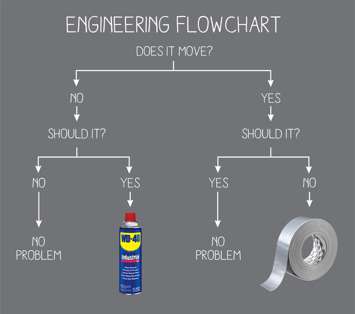

# Week 1 Lab: Everything Python in a few hours

## Introduction

- This week we will get an overview of all the components of the Python syntax. Theoretically, you will be able to do **any** programming task after this week ;-).

- More details about the development environment.

- How to ask questions and the three step process to general problem solving.

## Requirements

- A portable computer.
- List of questions from last week's lab
- Maybe some snacks for the lab. Keep it low GI if you can.

# Clinic

Getting the basics right is the key to being able to do this course. It's vital that you finish week 1's work as soon as possible.

If you didn't get a suite of beautiful green ticks last week, then the first thing we're going to do is fix that for you.

### _Your Name_

A lot of people are still called _Your Name_. Let's fix that first!

Your name in the faces means that we can learn your names faster. It also means that when you push your work to GitHub and we mark it, we know who has done the work. If you don't give us the information, the repo has marks, but you don't.

The information is in your `me` repo, the file is `aboutMe.yml`. Mine looks like:

```yml
name: Ben Doherty
studentNumber: z1234567
officialEmail: b.doherty@unsw.edu.au
contactEmail:
  firstBit: ben # this avoids spam, the @ is implied
  otherBit: notionparallax.co.uk
```

The `contactEmail:` line is blank because it's before an indented block. That'll all make sense by the end of this week, but for now, go with it.

Update the file with your info, save, stage, write a good message, commit, and push. Then wait 30 seconds and check if your info shows up on the [website](https://design-computing.github.io/).

### Can't get a wall of ticks?

#### Mac person?

We feel your pain, let's all get together at the start of the lab to work it out. A far as I can tell, [these tips will fix you up](https://design-computing.github.io/md/week1#are-you-a-mac-user).

There might be a more elegant fix, but at least to begin with, it should fix the biggest problems.

# How to do the exercises

Each file starts with a section of writing, wrapped in """triple quotes""". It tells you what the we want you to do. There's another one in each function that is more specific.

```python
"""Modify each function until the tests the_answer = None

    return the_answer.

The command to run the tests is:

python ../course/week2/tests.py


In each function, where you see:

    the_answer = None

replace None with the actual answer.

"""
```

This block is an example of a completed exercise function. It has a name, `add_1`; an argument, `a_number`; a `"""docstring"""`; some code; and a `return` statement. Take a look and I'll explain it all below.

```python
def add_1(a_number):
    """Return a number that is 1 bigger than number given.

    This isn't a trick!

    This is an example function to get you started.
    Run the tests now and this one should go green. Free marks!
    """
    the_answer = a_number + 1

    return the_answer
```

### name

`add_1`

### argument

`a_number`

### `"""docstring"""`

The text in `"""triple quotes"""` is called the docstring; it's important in python functions because it explains to auto-documenters what your function does, and it also shows as context help in your editor.

### code

### `return` statement

## Lecture

<iframe src="https://docs.google.com/presentation/d/e/2PACX-1vSJzgHnvLKcSJPt5nfXaz314GprB-fnuoHpLDdafF5Mn4STjs370X7lMdDhn0fZClijt9tDG_lBVOI1/embed?start=false&loop=false&delayms=3000" frameborder="0" width="960" height="569" allowfullscreen="true" mozallowfullscreen="true" webkitallowfullscreen="true"></iframe>

## Lab

<iframe src="https://docs.google.com/presentation/d/e/2PACX-1vR17tPHvj11C7pOFkuTTxZ_2rcepz0PHUOa8h_wnzTHTRPBoTBBCrgrZVjn5V3NcYDM-s-kmaVOLfzf/embed?start=false&loop=false&delayms=3000" frameborder="0" width="960" height="569" allowfullscreen="true" mozallowfullscreen="true" webkitallowfullscreen="true"></iframe>

### Engineering Flowchart

In `fix_it` it asks about an engineeringFlowchart. This is it:



## Homework

- The first two readings
- homework exercises in week2 folder

## Readings

https://automatetheboringstuff.com/#toc: chapters 1-5 Really awesome book
